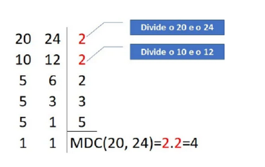

1. Criar uma função recursiva que receba 2 valores A e B e, por somas, apresente o resultado da
   mul plicação de A por B.

2. Criar uma função recursiva que receba o dividendo e o divisor de uma operação de divisão e, por
   subtrações, exiba o resto da divisão.

3. Construir uma função recursiva que receba um vetor e seu tamanho e apresente a quan dade de
   números pares existentes no vetor. Considere que a entrada deve ser, apenas de números naturais
   diferentes de zero.

4. Faça uma função recursiva que receba um número inteiro posi vo ímpar N e retorne o fatorial duplo
   desse número (A entrada deve ser validada fora da função recursiva). O fatorial duplo é definido como o
   produto de todos os números naturais ímpares de 1 até algum número natural ímpar N. Assim, o fatorial
   duplo de 5 é:

    5!! = 1 * 3 * 4 * 5 = 15

5. O máximo divisor comum (MDC ou M.D.C) corresponde ao produto dos divisores comuns entre dois ou
   mais números inteiros. Para calcular o máximo divisor comum (MDC) entre números, devemos realizar a
   fatoração por meio da decomposição em fatores primos dos números indicados.
   Para exemplificar, vamos calcular através da fatoração o MDC do 20 e 24:

   

   Para saber o MDC dos números, devemos olhar à direita da fatoração e ver quais números dividiram,
   simultaneamente, nas duas colunas e multiplicá-los.

   Assim, pela fatoração podemos concluir que o 4 (2 x 2) é o maior número que divide ambos e, portanto,
   é o máximo divisor comum de 20 e 24.

O máximo divisor comum (MDC) de dois números inteiros x e y pode ser calculado usando-se uma
definição recursiva:

• MDC(x, y) = MDC(x − y, y), se x > y

• MDC(x,y) = MDC(y,x)

• MDC(x,x) = x

Fazer uma função recursiva que receba 2 números inteiros posi vos e apresente o MDC desses números.