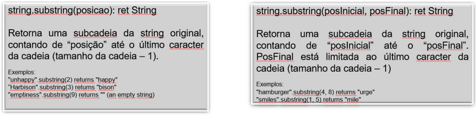
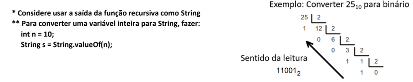
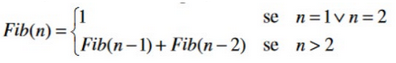

1. Crie uma função recursiva que exiba a quantidade de dígitos de um número inteiro passado como
   parâmetro:

   O código deve trazer como comentários:

   A condição de parada

   Como escrever a função para o termo n em função do termo anterior

2. Criar uma aplicação em Java que tenha uma função recursiva que, recebendo um número inteiro de 10
   a 999999 e recebendo um 2o número inteiro (de 0 a 9), tenha uma função recursiva que apresente quantas
   vezes o 2o número aparece no primeiro.

   • Exemplo1: 1o. Número = 523578; 2o. Número = 5; retorno aparece 2 vezes

   • Exemplo2: 1o. Número = 836363; 2o. Número = 3; retorno aparece 3 vezes

   • A validação da entrada e do dígito deve ser feito na main da aplicação e não na função recursiva;

   • O Código deve apresentar, em formato de comentário, como foi definida a condição de parada;

   • O Código deve apresentar, em formato de comentário, como foi definida a relação de chamada
   dos passos;

   Dica para a resolução do exercício:

   Exemplo: Número 1234

   1234 / 10 = 123 com resto 4

   123 / 10 = 12 com resto 3

   12 / 10 = 1 com resto 2

   1 / 10 = 0 com resto 1

   Exemplo: Número 8647

   8647 / 10 = 864 com resto 7

   864 / 10 = 86 com resto 4

   86 / 10 = 8 com resto 6

   8 / 10 = 0 com resto 8

3. Crie uma função recursiva que exiba o resultado da inversão de uma cadeia de caracteres
   (Ex.: entrada = teste ; saída = etset):

   Deve se utilizar a função SUBSTRING da Java
   O código deve trazer como comentários:

   • A condição de parada

   • Como escrever a função para o termo n em função do termo anterior

   

4. Criar uma aplicação em Java que tenha uma função recursiva que, recebendo um número
   inteiro, converta para binário. Entrada limitada a 2000.

   • O Código deve apresentar, em formato de comentário, como foi definida a condição de
   parada;

   • O Código deve apresentar, em formato de comentário, como foi definida a relação de
   chamada dos passos;

   

5. Considere a série de Fibonacci:

   1, 1, 2, 3, 5, 8, 13, 21, 34, 55, ...

   Que pode ser definida por:
 
   

   Escrever uma função recursiva que, dado uma posição da série, a função retorne seu valor.
Entrada limitada a 20 (Condição que deve ser testada na Main da aplicação).

   • O Código deve apresentar, em formato de comentário, como foi definida a condição
de parada;

   • O Código deve apresentar, em formato de comentário, como foi definida a relação de
chamada dos passos;

6. Criar uma aplicação em Java que tenha uma função recursiva que, recebendo um número
   inteiro (N), apresente a saída da somatória

   S = 1 + 1/2! + 1/3! + 1/4! + ... + 1/N!

   • O Código deve apresentar, em formato de comentário, como foi definida a condição
de parada;

   • O Código deve apresentar, em formato de comentário, como foi definida a relação de
chamada dos passos;