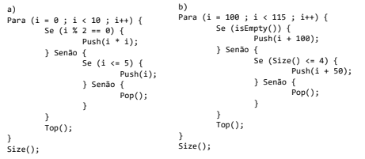
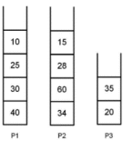

1. Simular o comportamento de pilhas dinâmicas para os algoritmos abaixo (A simulação deve
   deixar evidente a pilha que sobrou na memória):

2. Considere as pilhas iniciais já criadas e populadas

Admita que um método Java, chamado exibePilha, receba essas três pilhas como parâmetros e
execute os seguintes passos (Fazer como teste de mesa):
   1. Cria duas pilhas auxiliares, A1 e A2, inicialmente vazias;
   2. Remove um elemento de P1 e o insere em A1. Em seguida, remove um elemento de P2 e o
      insere em A1. Repete esses dois procedimentos até que P1 e P2 fiquem, ambas, vazias;
   3. Remove um elemento de P3 e o insere em A1. Repete esse procedimento até que P3 fique
      vazia;
   4. Remove um elemento de A1 e o insere em A2. Repete esse procedimento até que A1 fique
      vazia;
   5. Remove um elemento de A2 e o exibe no console. Repete esse procedimento 4 vezes.
      
O que será exibido no console e como ficarão as pilhas, quando o método exibePilha for executado?

3. Em Java:

   a) Transformar o projeto em uma biblioteca de uma Pilha de Inteiros, gerando o JAR PilhaInt.
   
    b) Adaptar o modelo de Pilha Dinâmica desenvolvido em aula, com os métodos esperados, para
   uma Pilha de Strings. Transformar o projeto em uma biblioteca, gerando o JAR PilhaStrings.

4. Implementar um novo projeto Java com base biblioteca PilhaInt que permita a conversão de
   decimais para binários, a qual se dá dividindo, sucessivamente, o valor de entrada por 2 e
    concatenando os restos da divisão do último para o primeiro.

    O projeto deve ter uma classe ConverteController no package controller, que inicialize uma pilha
    de inteiros e com um método decToBin(int decimal): String, que, recebendo um número decimal
    e realizando as operações, irá inserindo os restos das divisões na pilha. Ao término do
    empilhamento, deverá ser feita a operação de desempilhar, concatenando cada número
    desempilhado (Convertendo para String) com o próximo, até a pilha esvaziar.

    Deve-se ter também uma classe Principal no package view que permita ao usuário inserir um
    número decimal limitado a 1000.
